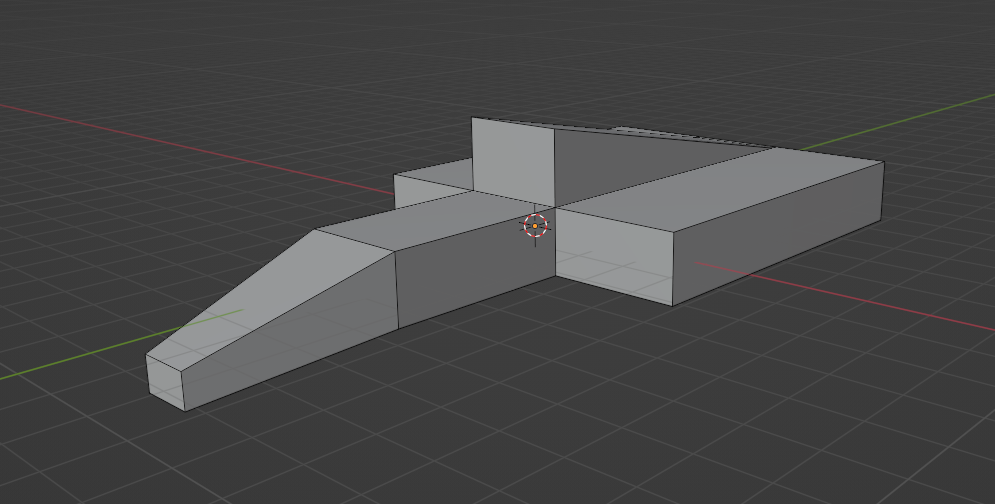

# Modelling Process

The scene consists of 9 different models - described below.
1. The Garage
2. The Cars
3. Stools
4. Workstations
5. Laptops
6. Screens/Monitors
7. Trolleys
8. Steering Wheels
9. Garage doors
10. Ceiling Lights

## The Garage

The garage is probably the simplest model, and was the first to be created. It consists of various cube meshes - scaled, rotated, and joined so that they create a semi-enclosed room with 1 side open. Another cube mesh was used to create a central pillar so that the garage has two exits - one for each car.

Originally I had planned to go with a concrete-style material for the inner walls using the noise node with high detail to create a rough-looking surface. Unfortunately it just looked kind of ugly, so I decided to stick to using it only for the central pillar to showcase that it's a permanent part of the architecture. In order to emulate a modern F1 garage it seemed more appropriate for the walls and ceiling to have a glossy-looking clean material. This was done simply through adjusting the base colour, reducing metallic to zero and lowering the roughness so that light was reflected well but without being over-reflective.

## The Cars

The cars are the most important and central models of the scene - and thus the most time was put into them.
They're split into two parts - the main body (chassis) and the wheels. Keeping them as separate objects allows for the wheels to be animated separately from the rest of the body.

### Wheels

To generate the semi-filled cylinder type shape of a wheel, a cylinder mesh was created with a cap fill type of 'nothing', and then a solidify modifier was added to thicken the walls. Both the tyre and the wheel structure were created doing this and scaled to appropriate sizes.
Using just simple cylinders did cause the edges of the tyres to be very sharp, rather than the slight bulge outwards you'd expect, so some loop cuts were made around the circular face and the centre-most cuts pulled out slightly to create a curving effect and soften the edges. Finally, a subdivision surface modifier was added to add some extra resolution.
The spokes for the internal wheel structure involved loop cuts in the outside of the cylinder and then extruding specific faces at set intervals towards the wheel object. A subdivision surface modifier was added to this too to provide some curvature, as the initial extrusions looked quite 'blocky' and unsatisfying.

The materials for the wheels were also fairly simple - A dark grey material with fairly high roughness and zero metallic for the tyres, and then a light grey, high metallic, low roughness material for the wheel structure to create a silvery metal look.

### Car Body
As most great models do, the car body started as a cube. It was scaled lengthwise and loop cuts made to split the model into 3 sections. Creating the nose was as simple as scaling down the end face of the front section and moving the section down slightly. The front wing was made by performing a number of loop cuts on the underside of the nose and extruding out a small rectangle downwards. From this, the wing itself could be extruded sideways as well as the wing's endplates.

The back section was then widened and a long strip of the middle extruded upwards to create an upside down T-shape. These would serve as the sidepods, roll hoop and engine cover. Many more loop cuts were made to allow finer tuning of the shape of the chassis. On reflection, I should have utilised the mirror modifier available in Blender, rather than creating it all at once - since, despite using the grid to try mirror things by look, there are bits of the model that aren't perfectly even. Additionally, the shape of the sidepods could have been done using the sculpting tool for a more realistic look, but that may have taken away from the semi-lowpoly feel of the models.

#### Progress Screenshots

The body of the car uses the same red theme as the rest of the scene, with the metallic level turned up just a little bit and the roughness brought down to give a clean shiny look. The team's logo was also added to the nose of the car (a really simple model reminiscent of the Ferrari logo, but with a raccoon's head instead of the iconic horse).

## Stools

The inspiration and slight reference (not exact) for the garage stools was just the bog-standard breakfast stool (such as [this](https://www.simplybarstools.co.uk/semplice-bar-stool-black/)).

The main leg of the stool consisted of just an elongated cylinder, with the base support being modelled in a similar fashion to the wheels - an empty cylinder with the solidify modifier. The two were connected in the same kind of method used to model the spokes of the wheel too, with a loop cut near the base of the leg and extruding a section out to the outer ring. To create the footrest, the base ring was duplicated and the duplicate moved up to a reasonable height, and connected with the same kind of spokes. However, to add a bit more individuality to it the footrest was shortened to be only around 45 degrees rather than the full 360. This was done by performing loop cuts at each end of the desired area and then simply deleting the other edges and vertices. With a subdivision surface modifier, this actually came out better than I'd expected/hoped. 

Modelling the stool seat was a matter of creating a cylinder and then adding a loop cut near the top, selecting that top face and then scaling it down so a gradient was formed to give a rounder edge. A slightly squished sphere was cut in half and added to the underside of the seat as a support.

The seat uses a rough, dark grey material with a noise node added to simulate the rippling you'd see on the fake leather usually found on this type of stool. The leg and footrest materials were essentially the same as the wheel structures - a shiny, silvery metal.

## Workstations

Given the workstations would mostly be hidden by stools, they didn't have to be particularly spectacular. Simply scaling a cube up to the right shape and performing a couple of loop cuts to allow the bottom to bevel inwards was enough. Likewise, the surface top was just a flattened cube with slightly bevelled edges. 
To keep with the 'clean' glossy look that modern F1 garages have the workstations utilized the same plasticky red that the walls and ceiling used, while the surface is a slightly rougher black.

## Laptops

To model the laptops, a cube was 'flattened' and scaled upwards on the x and y axes to create the laptop base. This was then duplicated and rotated to create the laptop's screen/lid. Loop cuts were made near each edge of the lid to create a lip around the edges. The inner face of this was then scaled down a tiny bit and then extruded inwards. The scaling allows there to be a slight gradient rather than just a sharp 90 degree angle. 

The keys started as a single row of individual cube meshes, followed by duplicating the row a number of times to get a decent number of keys. Initially an array modifier had been used to do this, but that didn't allow for modifying individual keys to imitate the larger keys (e.g. space bar and return). Once the keys had been sized to look somewhat similar to a standard keyboard, the touchpad was modelled by just putting a number of loopcuts on the base panel of the laptop and setting it to a different material colour.

More time could have been spent making the keyboard more realistic, but given the render and animations don't really showcase the laptop keyboards at all it didn't seem like a good use of time to commit to making something that isn't even seen.

The materials were nothing fancy - simply a rough metallic grey for the laptop casing. The keys and screen used a darker grey with similar roughness, but metallic turned all the way to zero to give a plastic feel.

## Screens/Monitors

The monitors were modelled off my own BenQ monitor, although simplified a little. The actual screen portion was modelled in essentially the same manner as the screen of the laptop, as were the wall screens. The base started as a cylinder which was then flattened and widened through scaling to create the familiar stretched circular base found on most monitors. The stand itself was extruded from the back of the screens, with some edge selections + moves to create nicer angles.

The materials were as you'd expect for a monitor/screen - a simple black, zero metallic and low roughness for everything but the screen. The screen shared practically the same material, but with roughness turned up to give that 'dead' look that switched off screens have.

On reflection, power buttons and cables could have been added for extra detail - however in the context of the scene it doesn't seem particularly important, as the cars should draw most of the attention of the viewer.

## Trolleys

The trolleys were more of a pain than expected. Originally I had tried to do it just using loop cuts and extrusions from a cube but was unable to get comfortable curves on the edges using that method. This led to having to create the edges separately and join them together, then curve the corners to give a more modern aesthetic by moving selected edges. The shelves were simple enough with just being scaled cubes, as were the wheels as cylinders.

As with a lot of the scene, the trolleys use a metallic-ish red and just a plain black with no adjustments for the wheels as they're generally out of sight and thus don't require the same level of pretty as the more visible models do.

## Steering Wheels

The steering wheel was also a bit of an annoyance to model. As with most of the other models, it started as a cube and was transformed with a number of loop cuts and extrusions. Things got a bit tricky trying to make the handles rounder and this was eventually achieved with an absurd number of loop cuts and tiny adjustments being made on individual faces/edges. The buttons and screen were made by selecting individual faces on the many loop cuts on the front face of the steering wheel and using the transform tool to move them outwards rather than extruding. This gave each button a more round look rather than my original attempts that had involved extrusion and simply looked awful - like something you'd expect in an early 1990s racing game. 

I tried to go with a sort of high-quality plastic look for the main body of the wheel, with a black base colour and roughness turned quite high. The buttons and screen were just basic colours but didn't seem to warrant anything further than that. 

This was a model that would have greatly benefited from using the mirror tool, as it's quite clearly a bit lopsided. Using a clearer reference may also have been beneficial for the placement of buttons and potential gearknobs, although with the semi-realism theme present it didn't have to be perfect and it represents a high-end steering wheel well enough.

## Garage Doors

The garage doors were also one of the simpler models - just a cube scaled lengthwise and an array modifier added. A plane was placed in the middle of the object so that the door had a ridged/corrugated look rather than essentially just being a wall.

As I wanted a slightly rusted look for the door, this was the biggest venture into creating a complex material. Object texture co-ordinates feeding into a musgrave texture node with detail of 12 provided the rusting pattern by feeding the height into the metallic node. Feeding this output also into a colour ramp node allowed for setting a gradient of rusting colour. The texture co-ordinate node was also fed into a noise texture which then fed into another colour ramp. This colour ramp used black and white to determine the strength of the rusting colours by feeding into the same Mix node that the first colour ramp did. This Mix was then put into the base colour.

## Ceiling Lights

The ceiling lights were based off the same hanging light panels you see in F1 garages - designed to illuminate the cars. The main light part was formed from a cube and using loop cuts in the same manner as the screens, an inner section was extruded inwards so that a small lip was created around the edge. The gradient on the top of the light was formed by having a single loop cut through the centre of the x and y axes, and then transforming that centre point upwards. The hanging supports are simply just cylinders scaled to be very long and very narrow, which are then each joined to a torus mesh that's only half-poking out through the main light bit. 

A metallic grey material was used for the majority of this model, with an emissive white used on the light panel itself.

# Scene Setup and Lights

As each model was created in its own file, they were each exported as FBX files and imported into the garage model file to create the scene. Using a number of different reference images of modern motorsport garages, the models were moved into reasonable places and a lot of scaling issues had to be fixed (pretty much everything was huge). 

The camera was set up in one of the corners of the garage, about halfway up the wall, so that the entirety of one side of the garage could be viewed whilst also being able to view some parts of the other side. More could be seen if the camera had been higher up, but with the focal length set to give a fairly wide field of view this would have ended up making the cars seem even smaller and more of the models in the corners to become even more distorted (you can notice that the stools on the left appear slightly wider).

It was important to have the cars directly under their respective ceiling lights, as these would be the only source of lighting in the entire scene.
Rectangular 300W lights were placed just underneath the ceiling lights so that the light would go in both directions and light up the emissive light panel of the ceiling lights as well as the cars underneath. 

# Render

The scene was rendered in Cycles, using GPU Compute and with the light bounces set to the default of 12. The render settings were left as default really as the outcome was in line with my vision.
